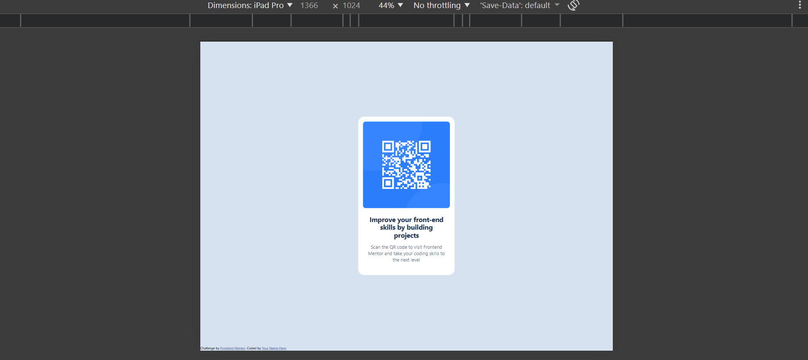

# Frontend Mentor - QR code component solution

This is a solution to the [QR code component challenge on Frontend Mentor](https://www.frontendmentor.io/challenges/qr-code-component-iux_sIO_H). Frontend Mentor challenges help you improve your coding skills by building realistic projects.

## Table of contents

- [Overview](#overview)
  - [Screenshot](#screenshot)
  - [Links](#links)
- [My process](#my-process)
  - [Built with](#built-with)
  - [What I learned](#what-i-learned)
  - [Continued development](#continued-development)
  - [Useful resources](#useful-resources)
- [Author](#author)
- [Acknowledgments](#acknowledgments)

## Overview

### Screenshot

#### Designs Provided By Frontend Mentor to Complete the Challenge

#### Final Screenshots of My Work

### Links

- Solution URL: [Solution URL at Github](https://github.com/dev4449/qr-code-component)
- Live Site URL: [Live site URL at Github Pages](https://dev4449.github.io/qr-code-component/)

## My process

### Built with

- Semantic HTML5 markup
- CSS custom properties
- Flexbox
- Mobile-first workflow

### What I learned

I didn't learn much by completing this challeng because I used my existing knowledge to complete it. I'm not sure if the font css properties, specifically, those I had to copy over from other sources and not specified by the Frontend Mentor challenge, are correct and I generally don't know how much should I learn and develop skills for typography and fonts as a frontend engineer.

I do welcome and appreciate hints on where I can improve. Thanks for reviewing my work.

### Continued development

I believe I need to learn flexbox and grid deeply and gain knowledge and develop skills on accessibility semantic HTML.

### Useful resources

## Author

- Frontend Mentor - [@dev4449](https://www.frontendmentor.io/profile/dev4449)
- Discord - dev4449 - [dev4449](https://discord.com/users/dev4449)

## Acknowledgments
